# Commander Mode: the abstract model

**Status:** a design, for the owner to react to. Nothing here is implemented as written, though almost all of it describes what the code already does. Written 2026-11-07.

**Audience:** the owner, and anyone reasoning about commander mode who wants the shape of it before the detail. [COMMANDER.md](COMMANDER.md) remains the reference for how it's built. This page asks what kinds of thing exist at all, and which rules follow from them.

## 1. The model on one page

Commander mode is a loop of five functions, and only one of them is the LLM.

```text
              perceive             speak               hear             decide              act
   Truth ---------------> Knowledge --------> Utterance ------> Belief ---------> Act ---------> Truth'
             the engine        the harness                the commander's      the LLM      the harness
                                                              records                      and the engine
```

| Function | Type | Who owns it | When it's wrong |
|---|---|---|---|
| `perceive` | `Truth × Station → Knowledge` | The engine | **Fog.** Soldiers missed someone. Leave it |
| `speak` | `Knowledge × Memory × Condition → Utterance*` | The harness | **Fault.** Fix at once |
| `hear` | `Belief × Utterance → Belief` | The commander's own records | Fault if the records lose it, judgement if the commander misreads it |
| `decide` | `Belief → Act*` | The LLM | **Judgement.** Not our problem |
| `act` | `Act × Truth → Truth'` | The harness and the engine | **Fault.** Fix at once |

Everything else in this document hangs off that loop:

- **Three strata of fact:** what's true, what a squad knows, what the commander believes. Only speech crosses between the last two ([section 3](#3-strata-of-fact)).
- **One kind of thing crossing the fog line:** an utterance, classified by how sure its speaker can be ([section 7](#7-speech)).
- **One kind of work:** a task, described by four properties. Every rule about orders comes from those properties ([section 8](#8-tasks-and-orders)).
- **One rule for conflicting orders:** an order takes the men it's entitled to, and whatever loses men it needs stops ([section 8.3](#83-claims-the-one-rule-behind-newest-wins)).
- **Two clocks:** the battle's, which never waits, and the commander's attention, which is scarce ([section 9](#9-time-and-attention)).

The most useful thing to come out of this is that the owner's way of judging a bad battle turns out to be the same structure as the system: find the first arrow in the loop that went wrong ([section 11](#11-review-sorting-a-bad-outcome)).

### Notation

Types are written so anyone can read them, and they aren't tied to a language.

```text
A | B        one or the other            A*        any number of them
A × B        both together               A?        maybe absent
A → B        a function                  Name(A)   a kind of thing holding an A
```

## 2. What's upstream of what

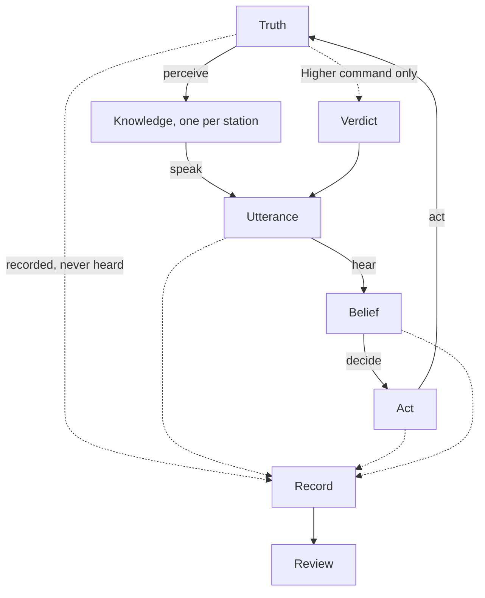
```mermaid
flowchart TD
  T[Truth] -->|perceive| K[Knowledge, one per station]
  K -->|speak| U[Utterance]
  U -->|hear| B[Belief]
  B -->|decide| A[Act]
  A -->|act| T
  T -.->|Higher command only| V[Verdict]
  V --> U
  T -.->|recorded, never heard| R[Record]
  U -.-> R
  A -.-> R
  B -.-> R
  R --> AAR[Review]
```

The dotted arrows are the only ones that touch truth without going through a squad. `Verdict` is deliberate and rare. `Record` is for the people reviewing afterwards, and nothing in it ever reaches the commander.

Concepts below this page's level, deliberately left out as **realisation**: waypoints, `doMove`, CBA tasks, ACE, SQF, packets, MCP. The same model would describe the same game on another engine. The one realisation that keeps coming up is the packet, because its shape is where several real bugs lived ([section 12](#12-invariants)).

## 3. Strata of fact

```text
Stratum = Truth                  what is the case. The engine holds it
        | Knowledge(Station)     what one squad's men have noticed. Can be wrong, late or missing
        | Belief(Commander)      map, notes, lists, reports heard. Only ever built from speech and its own acts
        | Record                 everything, kept for review. Reaches nobody during a battle
```

Every datum in the system lives in exactly one stratum, and most design questions come down to asking which. The same real thing has a separate value in each:

| Stratum | "Where's V1?" |
|---|---|
| Truth | [4039, 6052], moving |
| Knowledge(Alpha) | Under us, we're driving it |
| Belief | V1, grid 061 060, because that's the last anyone said |

This gap is the point of the game, not a defect, and things this week came from getting it wrong in both directions:

- **Too much, nearly:** updating the commander's vehicle list from a moving squad would have been an easy fix for a wrong estimate, and it would have given the commander a live tracker for that squad. It was fixed inside the squad's reply, where the knowledge really is.
- **Too much, in fact:** checking this page against the code found that the casualty list *did* do that. Every packet rewrote a casualty's grid and the time of his "report", so the briefing tracked his carriers live, in a fight or not, and a man left behind vanished from the list when he died, with nobody having said so. Both are now fixed: the list holds what's been said, and nothing else.
- **Too little:** the squad itself quoted a 2 km walk to a truck it was sitting in, because the estimate read `Belief` when it should have read `Knowledge`.

**Rule:** a squad's speech is computed from `Knowledge`. Two narrow exceptions exist, and both are honest: what the commander told it (an order's own grid, and where its list has a vehicle when it's sent to one), and a name from the commander's list, which is how the two parties refer to the same thing.

## 4. Agents

```text
Agent = Commander     decides. Sees only speech and its own records
      | Station       a squad on the net. Perceives, speaks, obeys
      | Higher        says what's certainly true. Only about objectives, as each is met, and the mission's end
      | System        says the game's gone or the mission restarted. Outside the fiction, and only when it must
      | Operator      out of the fiction. Sets up and reads logs
      | World         everything else that acts: enemies, gravity, ACE
```

| Agent | Addressable by the commander | Speaks to it | Can be wrong |
|---|---|---|---|
| Station | Yes | Yes | Yes, about the world. Not about its own orders |
| Member | **No.** Only through its station | Only as his station | |
| Higher | No | Yes, rarely | **No,** and that's why it's believed over the map |
| System | No | Yes, rarely | No |
| Operator | No | No | |
| World | No | No | |

**A station is a role, not a group of men.** It outlives its leader, and possibly its men. A wiped-out station stays on the roster and goes quiet. Since `Station = Callsign × Members × Leader`, and `Leader` is a slot, succession needs no special case: "Leader down, Sam Reed has command" is just a change of who fills the slot.

**Hierarchy** is a tree of one level today. A platoon leader would be a station that commands stations, with nothing new in the types except a `Commander` at each node. The model allows it, and doesn't need it yet.

## 5. Things in the world

```text
Entity = Member      a soldier
       | Asset       Vehicle | Gun | Facility
       | Structure   a numbered building
       | Enemy       never named: only ever known as a contact

Place  = Grid | Handle(Marker) | Handle(Structure) | Handle(Facility)
```

### 5.1 A member's condition

The one taxonomy that has caused the most bugs, because "alive" sounds simple. A member has one condition and any number of situations, and they're independent.

```text
Condition = Able | Down | Dead                    Down: alive, no use, on a clock
Situation = Riding(Vehicle) | Busy(Task) | Apart(distance)     while Able
          | Lying | Carried | Aboard(Vehicle)                  while Down, see custody below
```

Which gives **strength as a family of sets, not a number**:

```text
Nominal ⊇ Living ⊇ Able ⊇ Free
                  Able ⊇ Present          Free and Present overlap, and neither contains the other
```

| Set | Means | Who needs it |
|---|---|---|
| `Nominal` | Everyone it started with, plus anyone who's joined it | "6 of 8" |
| `Living` | `Able` + `Down` | Whether an objective about "every man" is met. The false win came from reading `Able` here |
| `Able` | Could act if asked | "effective" |
| `Free` | `Able`, on foot, not on a task | Who can be told to carry |
| `Present` | `Able`, and riding or within 100 m of the leader. A carrier beside the leader is present and not free | Whether "all six are here" is true. "6 of 6 effective" with two men 900 m away came from reporting `Able` when `Present` was the question |

Each question has exactly one right set. A `count` with no set named is a bug waiting to happen: `alive` in today's packet means `Able`, and that's how the false win got in.

### 5.2 A casualty is a member with a custody

Nothing about a casualty is a new entity. It's a member whose condition is `Down`, plus who's responsible for him. A man's custody belongs to one job at a time, which is what "already being moved" means.

```text
Custody = Lying(Place) | Carried(by Member) | Aboard(Vehicle) | Treated(by Member)
Fate    = Up | Dead | Unknown(left behind)
```

"Unknown" is a real value and it matters: a squad that's left a man can't say what became of him. That's why `We've left Owen King` exists, why `Owen King's dead` is only said by a squad near enough to know, and why he stays on the commander's list if he dies out of sight.

### 5.3 Assets are things with seats, crews or a footprint

| Asset | What it adds | Example |
|---|---|---|
| Vehicle | Seats, mobility, an owner only by who's in it | HEMTT |
| Gun | A vehicle that also has ammunition and a crew | Mortar |
| Facility | A footprint that changes what a task costs | Aid post, medical truck |

A medical truck is both `Vehicle` and `Facility`. These are capabilities and not a hierarchy, which is why `isMedicalVehicle` can be a plain question about any vehicle.

## 6. Names

The commander and its squads have to mean the same thing without the commander ever holding an engine reference. So everything it can refer to is a **handle**, and handles all behave alike.

```text
Handle(T)  = a short id on the commander's list         V1, C1, A1, B3, O1, Alpha
Listing(T) = Handle(T) × what's believed about it × when it was last said
```

| Handle | For | How it gets on the list | Who issues it |
|---|---|---|---|
| `Alpha` | Station | Scenario | Operator |
| `V1` | Vehicle | Scenario, or a squad sees one | Harness |
| `B3` | Structure | Scenario, by area | Harness |
| `C1` | Casualty | A squad says someone's down | Harness |
| `A1` | Facility | A medic finishes one | Harness |
| `O1` | Marker | The commander, or the scenario | Commander |

**A listing is a belief with a date on it.** Every field can be stale, and that's correct: `C1`'s place is where he was last reported, or "place not given" if he went down in a fight. An order that uses it can be wrong, and "Can't find Sam Reed" is the honest result.

**A grid is the only name that isn't a handle,** and it's the only one a radio operator can use for fire: a fire mission takes a grid, because no gun crew knows what "B3" means. That's a rule about who holds which handles, and it's the same rule that stops an order leaking an engine reference.

## 7. Speech

Everything that crosses the fog line is an utterance. Nothing else does. An order's tool result says "sent" whatever has happened, so it isn't information. A question's tool result is the reply itself, which is an utterance arriving by a quicker route, and "No answer" is what silence sounds like.

```text
Utterance = Speaker × Addressee × Mode × Content × Precedence × Time
```

### 7.1 Mode: how sure can the speaker be?

This is the most upstream classification of speech. It's what the commander needs in order to weigh a line.

| Mode | Basis | Can it be wrong? | Example |
|---|---|---|---|
| **Commitment** | Its own order, just received | No, only overtaken | `Copy, moving to grid 034 030.` |
| **Self-report** | Its own men and kit | Rarely | `4 of 6 effective, 2 down.` |
| **Observation** | What it's noticed of the world | **Yes, that's the fog** | `Contact, a few infantry, bearing 045.` |
| **Projection** | A forecast from measured rates | Yes, and says so: "about" | `That's 2 km on foot, about 8 minutes.` |
| **Refusal** | It can't do what was asked | No | `Unable, nobody at V1.` |
| **Verdict** | Higher command's view of truth | No | `OBJECTIVE COMPLETE` |
| **Procedure** | The net itself | No | `Wait one.` |

"Treat reports as information, not fact" and "Believe `OBJECTIVE COMPLETE`" in the doctrine are both just this table, as advice.

### 7.2 Content: what it's about

| Content | Sentences | Triggered by |
|---|---|---|
| **Task** | Acknowledged, now doing, passing, arrived, on station, finished, can't, stopped, dropping the rest | The task's own life, [section 8.5](#85-life-of-a-task) |
| **Contact** | Contact, update, lost | Change in what it knows of enemies |
| **Own force** | Strength, leader, casualties, ammo, limps, apart, back with the squad | Change for the worse, or for the better when someone's waiting on it |
| **Assets** | Who's on what, gun status, abandoned vehicle seen | Change |
| **Effects** | Explosions, under fire, splash | What it saw or heard land |
| **Place** | B3 checked, B3 is a ruin | Task progress |

Speech has two triggers, **change** (unprompted) and **question** (asked). Every unprompted sentence needs a reason to exist now, which is why each has a threshold or a repeat limit. Each question topic is a `Knowledge → text` function, and a SITREP is just all of them.

### 7.3 Speakable: quantities a soldier could really say

Numbers never cross the fog line as they are. Each goes through a lossy function that matches what a person could say on a radio at that moment.

```text
Speakable(T) = T → Words, with stated precision
```

| Quantity | Spoken as | Loses |
|---|---|---|
| Own position | `Grid 052 191` | Below 100 m |
| Enemy bearing | `bearing 045` | Rounded to 5, with error added |
| Range | `roughly 300 metres`, `distant` | Rounded, then nothing |
| Count | `a few`, `about 8`, `many` | Exact numbers |
| Age | `seen now`, `a minute ago` | Seconds |
| Ammunition | `amber, about half` | Everything but a band |
| Own men apart | `about 300 m west` | Grid, on purpose |
| Time | `about 8 minutes`, `at least 3 minutes` | Seconds. "At least" when it can't be known |

### 7.4 Register: what a fight does to speech

A speaker's condition changes how it talks, without changing what's true. A squad is in combat on a fresh contact, or when it's suppressed, or has just lost someone, or shells are landing close. Note that this comes from what it perceives, and that a scripted man going down counts, so a squad can say "under fire" with no enemy about.

```text
Register = Calm | InCombat(suppression)
```

| | Calm | In combat |
|---|---|---|
| Own grid | Given | Withheld, unless asked directly |
| Delay | None | Grows with suppression, up to about 40 s. A Flash takes half that |
| A question | Answered now | `Wait one`, then a message when it can |
| Estimate | `That's 2 km, about 8 minutes.` | `At least 8 minutes, under fire.` |
| Abandoned vehicles seen | Reported | Not taken stock of |

### 7.5 Precedence

```text
Precedence = Flash | Priority | Routine
```

It doesn't decide what wakes the commander, or the order lines are read in, which stays by time. It does three smaller things: a Flash gets out faster and is marked as one, and if a briefing has too much traffic, Routine lines are the ones hidden. Roughly, Flash is a new enemy, Priority is something got worse or can't be done, and Routine is things going as planned.

**What wakes the commander is a separate question.** Unprompted speech does. A reply to its own question doesn't, nor does `Wait one`, nor a check-in that says what it said last time.

## 8. Tasks and orders

This is the centre of the model, and the part checked hardest against the code.

### 8.1 Four independent properties

Every order type is described by four properties. The first three are the design, and the fourth comes after them.

```text
Lane        = Course | Detail | Guns | Settings     what part of the station's activity it occupies
Ending      = Finite | Triggered | Standing | Instant    what makes it stop
Claims      = who it takes, and from whom           decides conflicts
Realisation = how the engine does it                not upstream, but it's why reports differ
```

They aren't fully independent, and it's better to say so. A `Detail` is always `Finite`, today. `Claims` varies by instance as well as by type: `MOUNT` takes everyone, or one man if it names a seat. `Realisation` is chosen to suit the `Ending`, though in the code it's often read the other way round, as "CBA tasks run until replaced".

| Lane | Meaning | How many at once |
|---|---|---|
| **Course** | What the squad as a whole is doing | One |
| **Detail** | Some men peeled off for a job | Any number |
| **Guns** | What its guns are doing | One per gun |
| **Settings** | How it does all of that | Not a task at all |

| Ending | Meaning | Reports |
|---|---|---|
| **Finite** | Has a natural end | Finished, or failed |
| **Triggered** | Ends when something happens | The thing that happened |
| **Standing** | Runs until replaced. May reach a milestone, but milestones aren't an end | `On station`, `In position`, `On the objective` |
| **Instant** | Done on receipt | Acknowledged |

### 8.2 All 22 orders

| Order | Lane | Ending | Claims | Realisation |
|---|---|---|---|---|
| `MOVE` | Course | Finite | Squad* | Waypoint |
| `SEARCH` | Course | Finite | Squad | Waypoint |
| `CLEAR` | Course | Finite | Squad | Scripted |
| `MOUNT` | Course, or Detail if it names a seat | Finite | Those on foot, or one man | Scripted |
| `DISMOUNT` | Course | Finite | Those aboard | Scripted |
| `SENTRY` | Course | Triggered | Squad | Waypoint |
| `HOLD` | Course | Standing | Squad* | Waypoint |
| `PATROL` | Course | Standing | Squad | Waypoint |
| `OCCUPY` | Course | Standing | Squad | Placing |
| `CORDON` | Course | Standing | Squad | Placing |
| `ATTACK` | Course | Standing | Squad | CBA |
| `DEFEND` | Course | Standing | Squad | CBA |
| `PATROL_AREA` | Course | Standing | Squad | CBA |
| `SWEEP` | Course | Standing | Squad | CBA |
| `HALT` | Course | Instant | Squad | Engine |
| `CARRY` | Detail | Finite | Free men, one each | Scripted |
| `TREAT` | Detail | Finite | Medics | Scripted |
| `AID_POST` | Detail | Finite | One medic | Scripted |
| `UNLOAD` | Detail | Finite | Nobody in particular | Scripted |
| `FIRE_MISSION` | Guns | Finite | Gun crew | Engine |
| `CHECK_FIRE` | Guns | Instant | Gun crew | Engine |
| `POSTURE` | Settings | Instant | Nobody | Engine |

\* "Squad" means everyone but gun crews, who stay on their gun and are announced as staying: `Pat Vane stays on V1.`

**This table was checked.** The order-type sets in the code's constants can be computed from it:

| Set in the code | Computed from the table |
|---|---|
| `ENDLESS` | `Standing`, except `HOLD`, which has its own refusal |
| `STANDS_ALONE` | `Instant`, plus lane `Guns` |
| `CARE_ORDERS` | Lane `Detail` |
| `PLACING_ORDERS` | Realisation `Placing` |
| `TASK_ORDERS` | Realisation `CBA` |
| `LEG_TYPES` | Realisation `Waypoint`, except `PATROL` |
| `SINGLE_LEG` | `Placing` + `CBA` + `CLEAR` |
| `SINGLE_LEG_ORDERS` | The same set as `SINGLE_LEG`, written a second time in another file |

None of them disagree. So today's eight sets, in two files, are one table seen from different angles, with a few more written inline in the code as literals such as `("HOLD", "SENTRY")`. "Must go last in a chain" isn't a rule anyone needs to remember: it follows from `Standing`.

### 8.3 Claims: the one rule behind "newest wins"

The commander's rule, as we've been describing it, has a list of exceptions: a new order cancels carries, except that `POSTURE` doesn't, and neither do fire orders, or `DISMOUNT`, and `CARRY` after `MOVE` leaves the move alone while `MOVE` after `CARRY` cancels the carry. Claims replace the list with one rule:

> **An order takes the men it's entitled to. A squad order is entitled to everyone. A detail is entitled only to men who are free. Whatever loses men it can't do without stops.**

"The newest order wins" is what that looks like from the commander's side for squad orders, and it isn't the rule itself. A first draft of this page said the newest claim always wins, and that's false: a second detail can't take men from the first. It gets whoever's left, or waits.

| Situation | Claims | Result under the rule | Today |
|---|---|---|---|
| `CARRY`, then `MOVE` | `MOVE` takes everyone, including the carriers | The carry stops | Same |
| `MOVE`, then `CARRY` | `CARRY` takes two free men, and the move goes on without them | Both go on | Same |
| `POSTURE` at any time | Takes nobody | Nothing stops | Same |
| `FIRE_MISSION` during anything | Takes the gun crew, who weren't in the move | Nothing stops | Same |
| `MOVE` during `FIRE_MISSION` | The crew stay on their gun | The guns keep firing | Same |
| `DISMOUNT` during a carry | Takes those aboard. The carriers are on foot | Nothing stops | Same |
| `TREAT`, then `HOLD` | `HOLD` takes the medics | Treatment stops | Same |
| `CARRY`, then a second `CARRY` | Only men still free | The second gets who's left, or "Nobody free" | Same |
| `CARRY`, then `TREAT` | Medics carrying aren't free | Treatment waits for them | Same |
| `MOUNT` with a seat, during a carry | Takes one free man | Nothing stops | Same, since this review |
| A man who's already someone's job | The casualty is taken too | "Already being moved", from anyone but the same squad's new `CARRY` | Same |
| `MOVE` during `MOUNT` | `MOVE` takes those still walking to a seat | **Boarding should stop** | **Different**: see [section 13](#13-where-the-code-and-the-model-disagree) |

The order-dependence that looks odd ("order the squad first and `CARRY` second") isn't a quirk. It's what happens when one kind of order can take from the other, and not the other way round.

An appended leg takes nobody new, so it stops nothing. Appending when there's no route to add to is a new route, and counts as a squad order.

### 8.4 Plans: orders as a small language

An order isn't a task. It's a plan made of tasks, and now that chains exist, it has a grammar.

```text
Plan = Task
     | Task then Plan                the chain
Task = Trip(Waypoint*) | any other order type

Well-formed: everything before the last step is Finite or Triggered, and that includes
             every leg of a trip: a HOLD partway along would never finish.
             Instant orders and the Guns lane stand alone, by decision.
```

Each station has **at most one plan**, and it lives in the Course lane. So any squad order replaces it, including `DISMOUNT`, which takes no men from a detail but does change what the squad as a whole is doing. `then` is the only combinator today, but it's clear what the others would be, and they'd go here rather than as new features. The design's "later" event triggers are the same shape:

```text
Plan = Task
     | Task then Plan                what we have
     | When(Condition, Plan)         "when Bravo reports arrived, Alpha moves"
     | Task and Plan                 "cover us while we carry", two lanes at once
```

`Schedule` turns out to be the same thing seen from outside:

```text
Trigger = At(time) | After(duration) | Every(duration) | Finished(previous step) | Heard(message)
Rule    = Trigger × Act
Act     = Directive | Query | Wake(note)
```

So a timer, a timed order, a repeating check-in and the next step of a chain are all `Rule`s, and differ only in their trigger. Today, the first three share code and the fourth doesn't.

### 8.5 Life of a task

```text
Sent → Received → Active → Milestone* → Ended(Outcome)

Outcome = Done
        | Moot(why)         the man died, or woke. Nobody failed, and the plan carries on
        | Failed(why)       can't be done. A plan stops here
        | Superseded(by)    another claim took its men
        | Silent            nobody's left to say
```

The important property is that **only `Silent` may end a task without speech**. A task that ends without a word is the worst thing that can happen to a commander, because it goes on believing something false. Six real cases were exactly that, and each was fixed by making the ending spoken: the medic who forgot a man still on a truck, the chain that would have been dropped quietly, the boarding that went on after "Halted", a man who died waiting his turn for a medic, the last medic being lost with men still waiting, and a timed order that couldn't go out, which only the operator's log heard about.

`Moot` and `Failed` are different on purpose. "Sam Reed's dead" ends the carry, and the truck should still go. "Nobody free to carry Sam Reed" means it shouldn't.

### 8.6 The machines underneath

Every task, and a good deal else, is carried out by a state machine. None of them is declared as one. Each is a string field, a set of flags, or a variable whose presence means something, stepped by a timer. This is the list, from a hunt through the code on 2026-11-07.

**Game side, per squad or per job:**

| Machine | Held as | States | Every path ends? |
|---|---|---|---|
| Carry | `"state"` in a hashmap | going, fetching, lifting, carrying, working, loading, done | Yes: each state has a timeout or a give-up |
| Treat job | `"state"`, plus a queue | queued, going, working, then up or released | Yes, since the queue was fixed this week |
| Aid post | `"state"` | going, building, then up or given up | Yes |
| Fire mission | `"state"` | firing, holding, then done, out, can't lay, gunner, destroyed, stopped | Yes |
| Boarding | `brmh_cmd_mount` `[vehicle, word, …]` and a list | going, then on, taken, unreachable, wrecked, nobody | Yes, with a deadline |
| Getting off | The same variable | going off, off, none, stuck | Yes, since a 30 s deadline was added |
| Clearing | Whether `clearQueue` exists, plus `clearLeft` and per-man deadlines | idle, between buildings, in a building, done | Yes, while anyone's able |
| Placing | `placed` as -1, 0 or 1 | idle, walking to spots, in position | Yes, with a deadline |
| CBA task | `task` flag, `releaseUntil` | running, being released | Released by the next order |
| A man's custody | `brmh_cmd_handled` on the casualty | free, carried, treated | Cleared by every finish and release |
| A man's availability | `brmh_cmd_busy` on the soldier | free, busy | **This is the claims rule, as a lock.** Every machine respects it now |

**Host side:**

| Machine | Held as | States |
|---|---|---|
| The battle | `mission_t`, `t0`, `ended`, `restarted`, `game_lost_since` | not ready, ready, running, ended, plus "game lost" over any of them. A restart is in practice an end: nothing re-enrols the stations |
| The commander's attention | `WakeLogic` | waiting, debouncing, in a turn, turn assumed over |
| A chain | `chains[callsign]` | sent, seen by the game, next step, failed, finished |
| An objective | `objectives_due`, `objectives_done` | not met, met and waiting out the grace period, confirmed. Since this week, "met" can go back to "not met" |
| A squad's order | `Tracker` fields `order`, `leg`, `route_done`, `on_station` | acknowledged, under way, passing, arrived or on station, done |
| Contact | `contact_active`, `contact_seen`, `contact_said` | none, in contact, lost |
| A casualty on the list | Its entry's `state` and `said_*` fields | listed, located again, gone |
| A man apart | `Tracker.apart` | with the squad, apart, reported apart, back |
| Speech in a fight | The outbox | said now, or held until its delay is up |
| The server's battle | `Server.runtime` | none yet, loaded, replaced |

**What the hunt found.** Each of these comes from two machines touching the same thing without agreeing, and every one is predicted by the claims rule in [section 8.3](#83-claims-the-one-rule-behind-newest-wins). That's a better test of the model than anything else on this page.

| # | Conflict | Effect | Fixed, and checked live |
|---|---|---|---|
| 1 | Clearing, placing and CBA tasks never check `busy`. Clearing hands every able man a building position each step, and placing `doStop`s them all | `CARRY` during a `CLEAR` sends the carrier off to a room. During an `OCCUPY`, he's stopped where he stands. The rule says a detail sent after a squad order keeps its men | Clearing and placing now leave men on a job alone, and a job turns its worker's pathing back on, since `DEFEND` turns it off at his post. [casevac_village](../scenarios/commander/casevac_village.yaml): a carry out of a `CLEAR` with nobody given another room, and a carry out of a `DEFEND` that arrives. `CORDON` shares the code with `OCCUPY`, and isn't run live |
| 2 | A treat job starting on a man doesn't check whether he's being carried, and sets his custody to "treated" over the top | `TREAT` for a man, then another squad's `CARRY` of him before a medic's free: the medic chases a man being carried away | A man being carried now waits his turn, as one on a truck does. In the same battle, the medics treated two men, waited for the third to be set down, then treated him |
| 3 | The fire mission's "is there a gunner" asks `alive`, and an unconscious gunner under ACE is alive and still in the seat | The gun never fires, and the mission ends after 15 s as "can't lay", which says the gun can't reach. The truth is that its gunner's down | It asks whether he's able now. [fire_check](../scenarios/commander/fire_check.yaml): "3 of 8 fired, no gunner on V1" mid-mission, and "Unable, no gunner on V1" for the next |
| 4 | Getting off has no deadline | A chain waiting on `DISMOUNT` would wait for good, silently, if anyone can't get out | 30 s, then "Can't get Owen King off the vehicle", which a chain treats as a failed step. [vehicles_check](../scenarios/commander/vehicles_check.yaml), with a man held in his seat |

Conflicts 1 and 3 are the same mistake as the false win: a machine asking a question about a man that only one of the sets in [section 5.1](#51-a-members-condition) can answer, and asking a different one. A declared machine would have had to say which.

### 8.7 Charts

Each machine as it is in the code. Where a state is a string in the code, the chart names it with exactly that string, as `state "going off" as going_off`, and [test_machine_charts.py](../host/tests/test_machine_charts.py) fails if the code and the chart disagree about which ones exist. Names without quotes are states the code holds some other way: a list a man is on, a flag, or a variable being there at all. Those are drawn as faithfully, and nothing checks them.

#### Game side

<!-- machine: carry -->
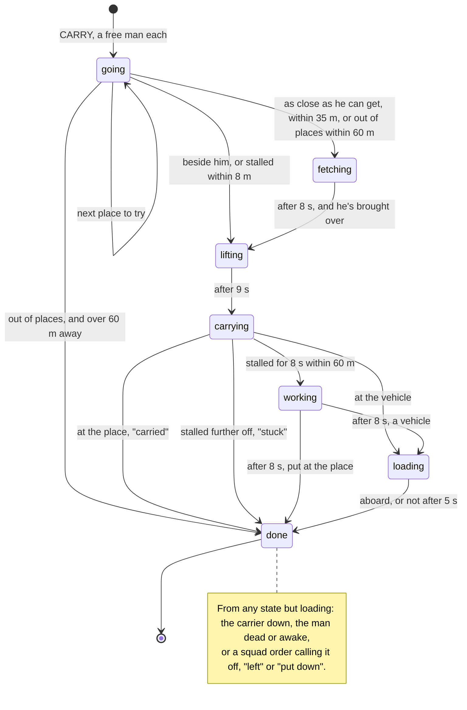
```mermaid
stateDiagram-v2
  state "going" as going
  state "fetching" as fetching
  state "lifting" as lifting
  state "carrying" as carrying
  state "working" as working
  state "loading" as loading
  state "done" as done
  [*] --> going: CARRY, a free man each
  going --> going: next place to try
  going --> lifting: beside him, or stalled within 8 m
  going --> fetching: as close as he can get, within 35 m, or out of places within 60 m
  going --> done: out of places, and over 60 m away
  fetching --> lifting: after 8 s, and he's brought over
  lifting --> carrying: after 9 s
  carrying --> loading: at the vehicle
  carrying --> done: at the place, "carried"
  carrying --> working: stalled for 8 s within 60 m
  carrying --> done: stalled further off, "stuck"
  working --> loading: after 8 s, a vehicle
  working --> done: after 8 s, put at the place
  loading --> done: aboard, or not after 5 s
  done --> [*]
  note right of done
    From any state but loading: the carrier down, the man dead or awake,
    or a squad order calling it off, "left" or "put down".
  end note
```

<!-- machine: treat -->
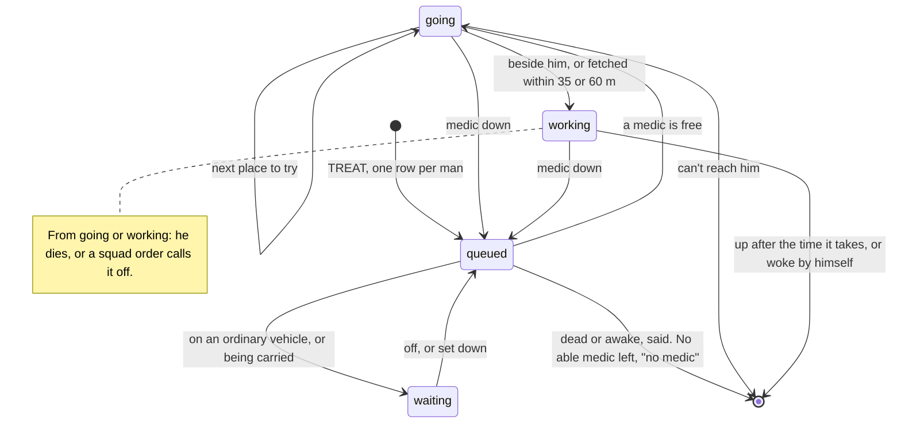
```mermaid
stateDiagram-v2
  state "going" as going
  state "working" as working
  [*] --> queued: TREAT, one row per man
  queued --> waiting: on an ordinary vehicle, or being carried
  waiting --> queued: off, or set down
  queued --> going: a medic is free
  queued --> [*]: dead or awake, said. No able medic left, "no medic"
  going --> going: next place to try
  going --> working: beside him, or fetched within 35 or 60 m
  going --> [*]: can't reach him
  going --> queued: medic down
  working --> queued: medic down
  working --> [*]: up after the time it takes, or woke by himself
  note right of working
    From going or working: he dies, or a squad order calls it off.
  end note
```

<!-- machine: post -->
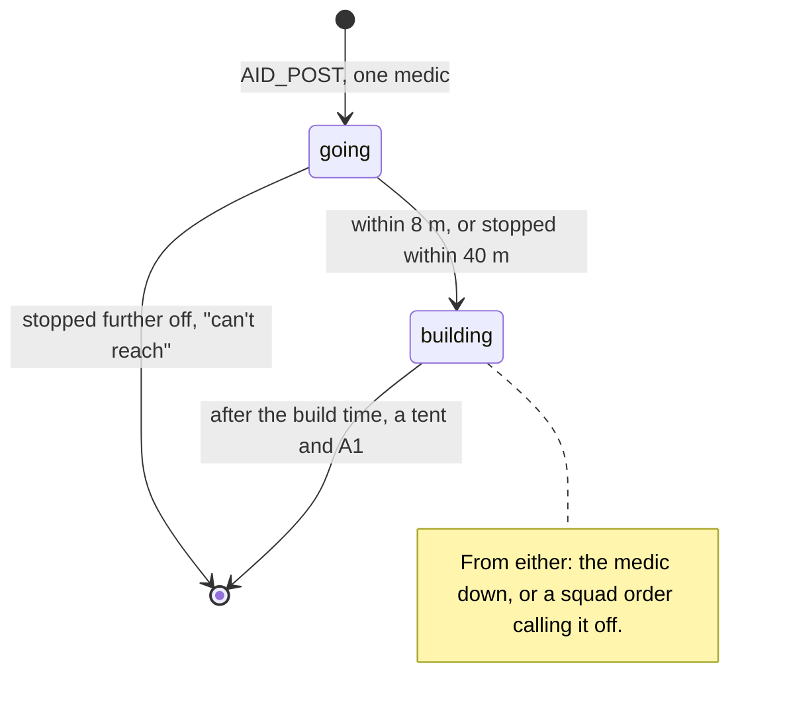
```mermaid
stateDiagram-v2
  state "going" as going
  state "building" as building
  [*] --> going: AID_POST, one medic
  going --> building: within 8 m, or stopped within 40 m
  going --> [*]: stopped further off, "can't reach"
  building --> [*]: after the build time, a tent and A1
  note right of building
    From either: the medic down, or a squad order calling it off.
  end note
```

<!-- machine: fire -->
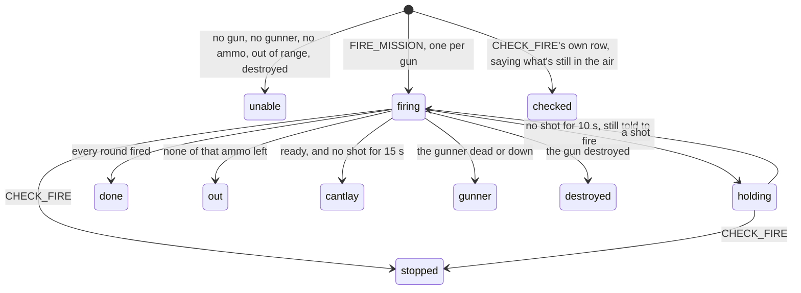
```mermaid
stateDiagram-v2
  state "unable" as unable
  state "firing" as firing
  state "holding" as holding
  state "done" as done
  state "out" as out
  state "cantlay" as cantlay
  state "gunner" as gunner
  state "destroyed" as destroyed
  state "stopped" as stopped
  state "checked" as checked
  [*] --> unable: no gun, no gunner, no ammo, out of range, destroyed
  [*] --> firing: FIRE_MISSION, one per gun
  firing --> holding: no shot for 10 s, still told to fire
  holding --> firing: a shot
  firing --> done: every round fired
  firing --> out: none of that ammo left
  firing --> cantlay: ready, and no shot for 15 s
  firing --> gunner: the gunner dead or down
  firing --> destroyed: the gun destroyed
  firing --> stopped: CHECK_FIRE
  holding --> stopped: CHECK_FIRE
  [*] --> checked: CHECK_FIRE's own row, saying what's still in the air
```

<!-- machine: boarding -->
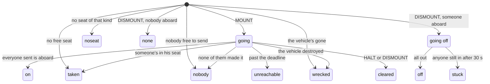
```mermaid
stateDiagram-v2
  state "going" as going
  state "on" as on
  state "taken" as taken
  state "nobody" as nobody
  state "noseat" as noseat
  state "unreachable" as unreachable
  state "wrecked" as wrecked
  state "none" as none
  state "going off" as going_off
  state "off" as off
  state "stuck" as stuck
  [*] --> going: MOUNT
  [*] --> wrecked: the vehicle's gone
  [*] --> noseat: no seat of that kind
  [*] --> taken: no free seat
  [*] --> nobody: nobody free to send
  going --> on: everyone sent is aboard
  going --> taken: someone's in his seat
  going --> nobody: none of them made it
  going --> unreachable: past the deadline
  going --> wrecked: the vehicle destroyed
  going --> cleared: HALT or DISMOUNT
  [*] --> going_off: DISMOUNT, someone aboard
  [*] --> none: DISMOUNT, nobody aboard
  going_off --> off: all out
  going_off --> stuck: anyone still in after 30 s
```

<!-- machine: clearing -->
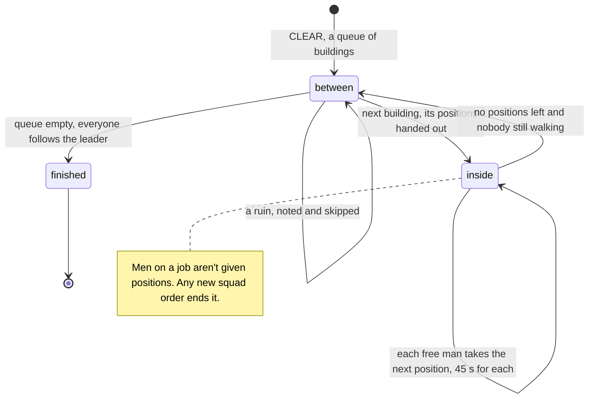
```mermaid
stateDiagram-v2
  [*] --> between: CLEAR, a queue of buildings
  between --> inside: next building, its positions handed out
  between --> between: a ruin, noted and skipped
  inside --> inside: each free man takes the next position, 45 s for each
  inside --> between: no positions left and nobody still walking
  between --> finished: queue empty, everyone follows the leader
  finished --> [*]
  note right of inside
    Men on a job aren't given positions. Any new squad order ends it.
  end note
```

<!-- machine: placing -->
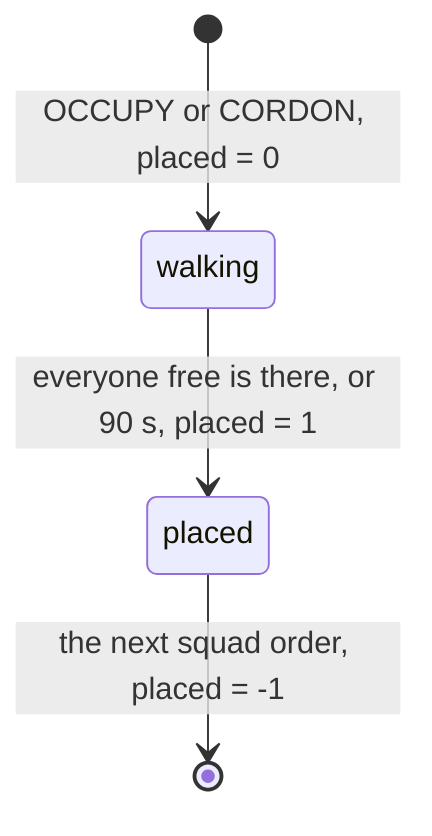
```mermaid
stateDiagram-v2
  [*] --> walking: OCCUPY or CORDON, placed = 0
  walking --> placed: everyone free is there, or 90 s, placed = 1
  placed --> [*]: the next squad order, placed = -1
```

<!-- machine: cba-task -->
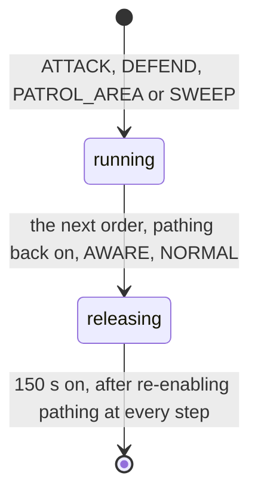
```mermaid
stateDiagram-v2
  [*] --> running: ATTACK, DEFEND, PATROL_AREA or SWEEP
  running --> releasing: the next order, pathing back on, AWARE, NORMAL
  releasing --> [*]: 150 s on, after re-enabling pathing at every step
```

<!-- machine: custody -->
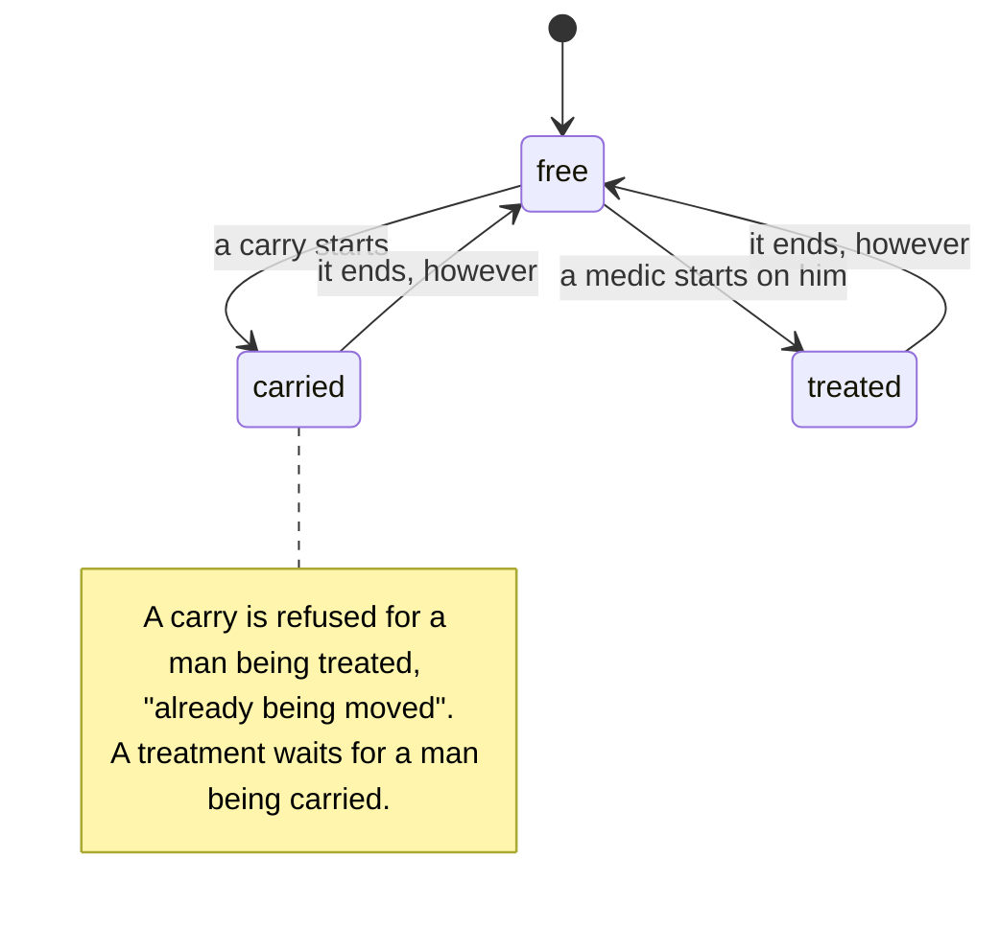
```mermaid
stateDiagram-v2
  [*] --> free
  free --> carried: a carry starts
  carried --> free: it ends, however
  free --> treated: a medic starts on him
  treated --> free: it ends, however
  note right of carried
    A carry is refused for a man being treated, "already being moved".
    A treatment waits for a man being carried.
  end note
```

<!-- machine: busy -->
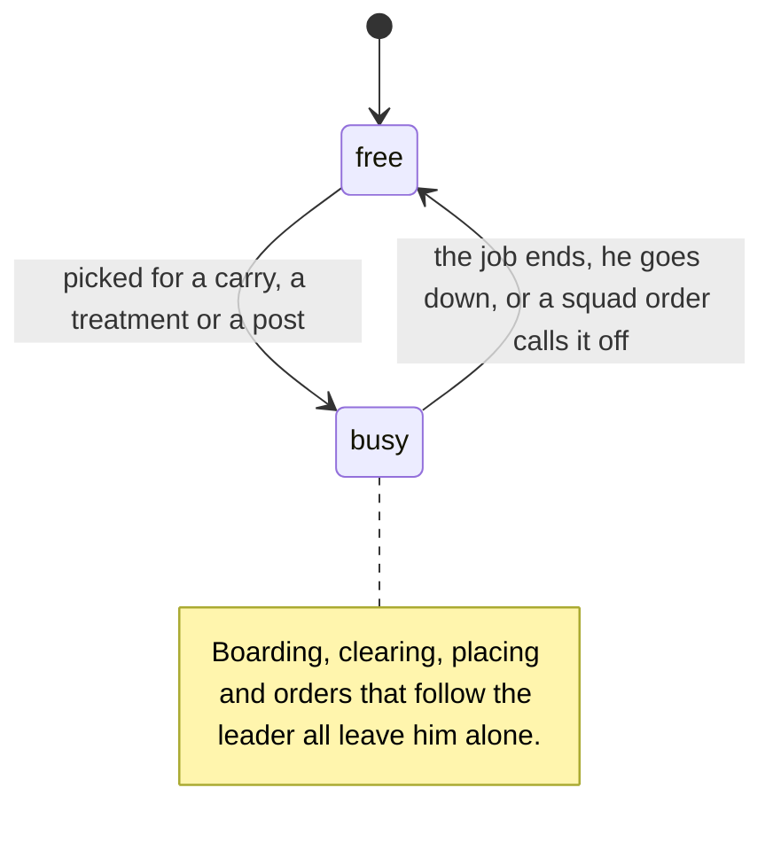
```mermaid
stateDiagram-v2
  [*] --> free
  free --> busy: picked for a carry, a treatment or a post
  busy --> free: the job ends, he goes down, or a squad order calls it off
  note right of busy
    Boarding, clearing, placing and orders that follow the leader all leave him alone.
  end note
```

#### Host side

<!-- machine: battle -->
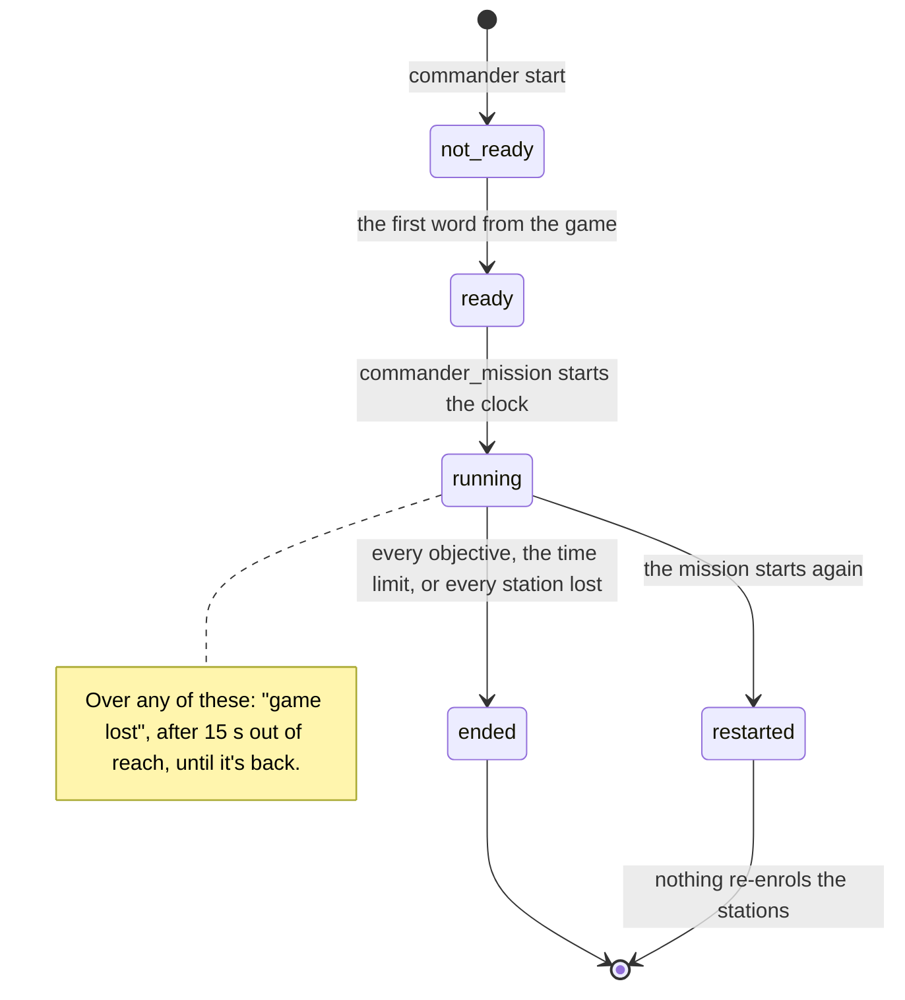
```mermaid
stateDiagram-v2
  [*] --> not_ready: commander start
  not_ready --> ready: the first word from the game
  ready --> running: commander_mission starts the clock
  running --> ended: every objective, the time limit, or every station lost
  running --> restarted: the mission starts again
  ended --> [*]
  restarted --> [*]: nothing re-enrols the stations
  note right of running
    Over any of these: "game lost", after 15 s out of reach, until it's back.
  end note
```

<!-- machine: attention -->
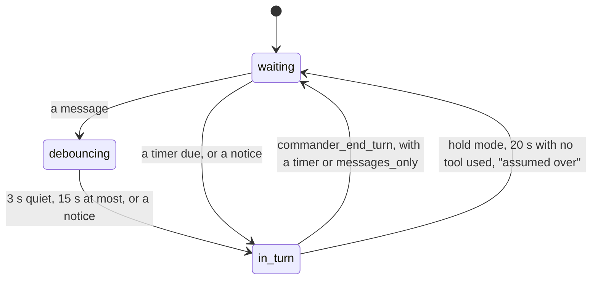
```mermaid
stateDiagram-v2
  [*] --> waiting
  waiting --> debouncing: a message
  debouncing --> in_turn: 3 s quiet, 15 s at most, or a notice
  waiting --> in_turn: a timer due, or a notice
  in_turn --> waiting: commander_end_turn, with a timer or messages_only
  in_turn --> waiting: hold mode, 20 s with no tool used, "assumed over"
```

<!-- machine: chain -->
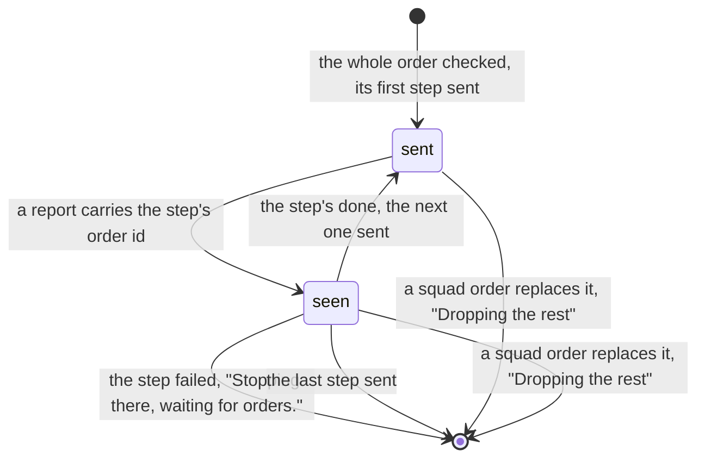
```mermaid
stateDiagram-v2
  [*] --> sent: the whole order checked, its first step sent
  sent --> seen: a report carries the step's order id
  seen --> sent: the step's done, the next one sent
  seen --> [*]: the step failed, "Stopping there, waiting for orders."
  seen --> [*]: the last step sent
  sent --> [*]: a squad order replaces it, "Dropping the rest"
  seen --> [*]: a squad order replaces it, "Dropping the rest"
```

<!-- machine: objective -->
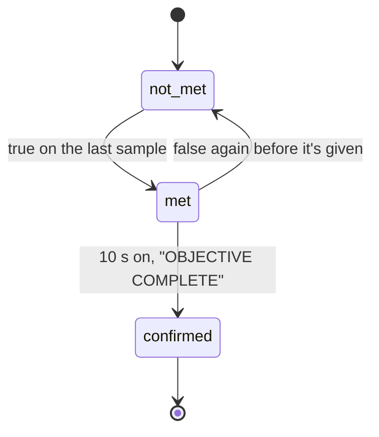
```mermaid
stateDiagram-v2
  [*] --> not_met
  not_met --> met: true on the last sample
  met --> not_met: false again before it's given
  met --> confirmed: 10 s on, "OBJECTIVE COMPLETE"
  confirmed --> [*]
```

<!-- machine: order -->
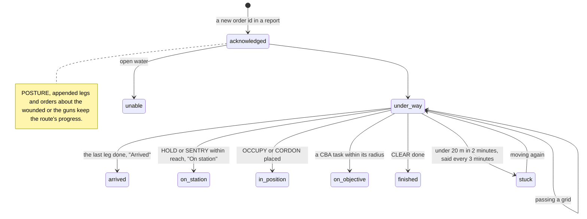
```mermaid
stateDiagram-v2
  [*] --> acknowledged: a new order id in a report
  acknowledged --> under_way
  under_way --> under_way: passing a grid
  under_way --> arrived: the last leg done, "Arrived"
  under_way --> on_station: HOLD or SENTRY within reach, "On station"
  under_way --> in_position: OCCUPY or CORDON placed
  under_way --> on_objective: a CBA task within its radius
  under_way --> finished: CLEAR done
  under_way --> stuck: under 20 m in 2 minutes, said every 3 minutes
  stuck --> under_way: moving again
  acknowledged --> unable: open water
  note right of acknowledged
    POSTURE, appended legs and orders about the wounded or the guns keep the route's progress.
  end note
```

<!-- machine: contact -->
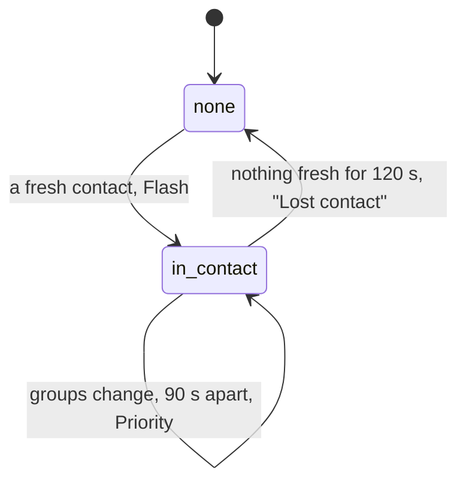
```mermaid
stateDiagram-v2
  [*] --> none
  none --> in_contact: a fresh contact, Flash
  in_contact --> in_contact: groups change, 90 s apart, Priority
  in_contact --> none: nothing fresh for 120 s, "Lost contact"
```

<!-- machine: casualty-list -->
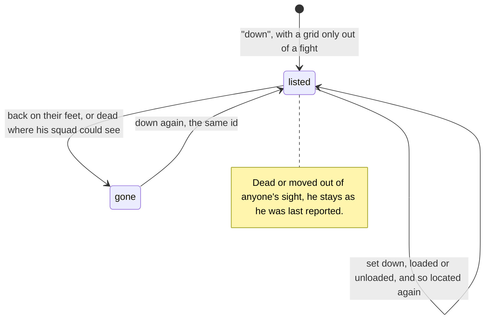
```mermaid
stateDiagram-v2
  [*] --> listed: "down", with a grid only out of a fight
  listed --> listed: set down, loaded or unloaded, and so located again
  listed --> gone: back on their feet, or dead where his squad could see
  gone --> listed: down again, the same id
  note right of listed
    Dead or moved out of anyone's sight, he stays as he was last reported.
  end note
```

<!-- machine: apart -->
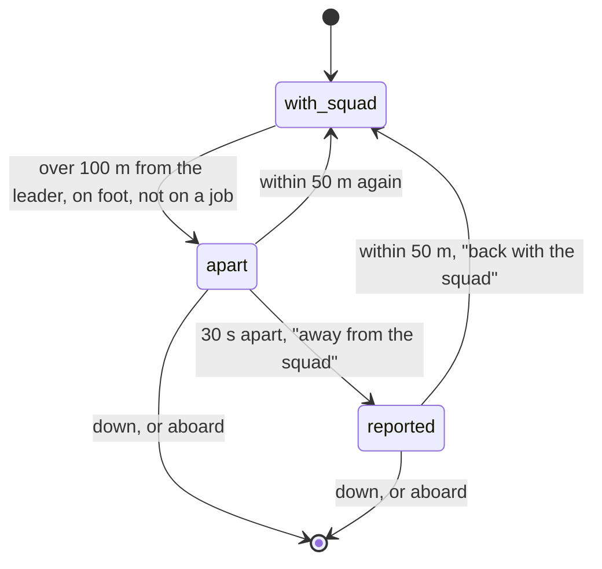
```mermaid
stateDiagram-v2
  [*] --> with_squad
  with_squad --> apart: over 100 m from the leader, on foot, not on a job
  apart --> reported: 30 s apart, "away from the squad"
  apart --> with_squad: within 50 m again
  reported --> with_squad: within 50 m, "back with the squad"
  apart --> [*]: down, or aboard
  reported --> [*]: down, or aboard
```

<!-- machine: outbox -->
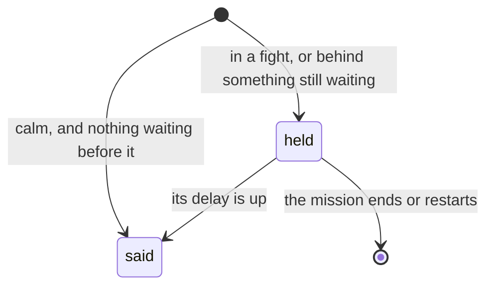
```mermaid
stateDiagram-v2
  [*] --> said: calm, and nothing waiting before it
  [*] --> held: in a fight, or behind something still waiting
  held --> said: its delay is up
  held --> [*]: the mission ends or restarts
```

<!-- machine: server -->
```mermaid
stateDiagram-v2
  [*] --> none
  none --> none: no battle set up yet, "try again in a minute"
  none --> loaded: the battle commander start set up
  loaded --> replaced: a new battle set up, or stopped
  replaced --> [*]: tools say so, and the loop stops
```

Smaller machines that aren't charted: stuck reports, which are part of the order chart, ammunition bands, which only ever get worse, limps, and the check-in that stays quiet when nothing's changed.

## 9. Time and attention

```text
Clock     = MissionTime                 runs whatever anyone is doing
Attention = Turn*                       the commander exists only in turns
Turn      = Wake × Briefing × Act* × End
Wake      = Timer(note) | Messages(n) | Notice(Higher)
```

There's no game loop that waits for the commander. **Thinking costs mission time**, and that's a mechanic and not a limitation. Three things follow directly:

| Consequence | How it shows up |
|---|---|
| Deciding when to look again is part of commanding | No fixed interval, and a turn that ends with no timer has to say so |
| Work should be delegated downward where it can be | Chains, timed orders, and squads that act without being told |
| Old information is normal | Every listing has an age, and reports can lag by half a minute or so in a fight |

`Briefing` is a function, `Belief × new Utterances → text`, and it's the only thing that makes a turn self-contained. Since it's pure, a new session can take over from the records. That's what "all memory is written down" amounts to.

## 10. Scenarios

A scenario is a value, and a battle is that value plus a commander.

```text
Scenario = Forces × Assets × Enemies × Objective* × Failure? × TimeLimit × Events × Dials × Brief

Objective  = Text × Predicate(Truth)      judged by Higher, on truth, with a short grace period
Predicate  = AllAt(Stations, Place, on_foot?)     every Living man within reach of it. If on_foot, nobody's
                                                  riding or down either. At least one must be Able
           | Eliminated                           no enemy in the scenario still Able
           | Reached(Station, Place)              its first Able man got there. A simple check, for simple scenarios
Failure    = all stations lost                    none of them with anyone Able
Event      = At(time) × World action              a man going down, a squad being lost
```

**Objectives are the one thing judged on truth,** which is why they have to be careful about which set they count: `AllAt` counts `Living`, and `Eliminated` counts `Able`. For enemies, down is out. For your own, down is still yours. That asymmetry is correct, and it's exactly the distinction the false win got wrong.

**The brief and the objective can differ,** and they did: `casevac_rv` asks for a rendezvous in its text, and only checks that all six reach the objective. Both Haiku and Sonnet noticed, in effect, and skipped the rendezvous in some runs. That's allowed: the brief is advice, and the predicate is the mission.

**Dials** are what a scenario can turn without any new code:

| Dial | Values today | Reserved |
|---|---|---|
| Delivery | Debounce, `hold` or `deliver` | Radio delay, loss, garbling |
| Medical | Field, facility and build times, wake chance | |
| Capabilities | `Station → Order types` | |

## 11. Review: sorting a bad outcome

The owner's rule is that a harness fault gets fixed at once, a reasonable belief that turned out wrong is the fog working, and a poor decision is the LLM's own. In terms of the loop, that's a single procedure:

> **Walk the loop from `Truth`, and find the first arrow where the output doesn't follow from the input.**

| First bad arrow | Called | Do | From this week |
|---|---|---|---|
| None: truth reached belief with no arrow at all | Leak, the most serious along with a bad verdict | Fix | The casualty list following a carried man |
| `perceive` | Fog | Leave | Soldiers walking past an enemy in a building |
| `speak` | Fault | Fix | `distant out`. LIMITED and FULL ignored by estimates. "6 of 6" with two men missing. 4 km "on foot" for a squad boarding |
| `hear` | Judgement, unless the wording invited it | Fix the wording if so | Sonnet reading "Get them off first" as sorted out: partly wording, so it's now "We'll treat them when they're off" |
| `decide` | Judgement | Leave | Not bringing a mortar to bear. Commanders ignoring the rendezvous |
| `act` | Fault | Fix | The carry nothing could cancel. Medics refusing a man by milliseconds. HALT that didn't stop boarding |
| `Verdict` | Fault, and the most serious | Fix | "All six on foot" passed with four |

Two refinements came out of writing this table:

- **`speak` has a test for whether something is a fault:** would a real squad leader in that position have known this, and said it? Haiku's 2 km carry looked like bad judgement until the answer turned out to be yes: they'd have said "that'll take 20 minutes". So that was `speak`, and the fix worked.
- **A correct arrow can produce a terrible outcome.** A commander that shells its own men on an old report has had every arrow work. That's the game.

`Record` exists to make this procedure possible: it holds each stratum separately, so a review can compare them at any moment. It needs nothing else from the rest of the system.

## 12. Invariants

Each of these is a rule the model implies. Those marked with a bug are ones this week showed aren't obvious.

| # | Invariant | What broke it |
|---|---|---|
| 1 | Only utterances cross the fog line. An order's tool result never varies with the state of the world | The casualty list, printing live positions |
| 2 | A squad's speech comes from its own `Knowledge`, apart from names and its own orders | A squad quoting a walk to a truck it was sitting in |
| 3 | Only `Silent` may end a task without speech | Six cases, [section 8.5](#85-life-of-a-task) |
| 4 | Every count names its set | `alive` meaning `Able`: the false win |
| 5 | A forecast and the behaviour it forecasts read the same state | LIMITED and FULL changing the game and not the estimate |
| 6 | An order takes only what it's entitled to, and nothing else stops anything | Orders that couldn't cancel carries. A one-man `MOUNT` that cancelled them |
| 7 | Only the last step of a plan may be `Standing` | A `HOLD` partway along a trip, or something appended after one, would never finish. Now refused |
| 8 | A plan is checked whole, when it's sent, and its later steps can only fail by being reported | Enforced |
| 9 | What's wrong with an order is refused when the commander could have known, and reported by the unit otherwise | |
| 10 | A session belongs to one battle, and says so if it's been replaced | A new session finding the last battle, and being told it had already won |
| 11 | Every field the game sends reaches what reads it | `speed_mode` dropped by a field list, which no test noticed |
| 12 | Nothing in `Record` reaches the commander | |

Invariants 2, 4, 5 and 11 could become properties of the code's types rather than things tests catch: see [section 14](#14-what-this-could-become).

## 13. Where the code and the model disagree

The model was compared with the code, not just written from it. These are the places they differ, and each one is a decision.

| # | Where | Model says | Code does | My view |
|---|---|---|---|---|
| 1 | `MOVE` during `MOUNT` | Takes the men walking to a seat, so boarding stops | Boarding carries on, then the truck drives | **The one real inconsistency left.** Both Haiku and Sonnet relied on it, and it looks like a helpful accident. Chains now cover what they wanted. I'd follow the rule, but a commander would get a surprise, so it's your call |
| 2 | `DISMOUNT` | Takes those aboard, so doesn't disturb carriers. But it's in the Course lane, so it replaces a plan | Exactly that | Fine. It's two separate questions. Worth stating, because it looks like an inconsistency between `CANCELS_A_CHAIN` and `callOffCare`, and it isn't |
| 3 | A verdict | Never wrong | Truth is sampled, so it can only be as right as the last sample before the word is given | Fine. It used to latch and not look again for 10 s, which is fixed |
| 4 | `MOUNT` naming a seat | A detail: one man, leaving the squad's course alone | Exactly that, since this review. The order type is still listed once, under Course | Fine. It's the one order whose lane depends on its arguments |
| 5 | Refusals | Priority | Water and boarding refusals are Routine, and care refusals are Priority | Harmless, since neither changes what wakes it. Inconsistent |
| 6 | `all_stations_lost` | Your own down are still yours | Counts `Able`, so all of them down loses the battle | Probably right as a game rule, since nobody's left to do anything, but it's the opposite of how objectives count |
| 7 | `HOLD` with `hold_for` | Would be `Finite` | Refused partway along an order, because the engine's `HOLD` doesn't complete. `MOVE` with `hold_for` is offered instead | Fine, though `MOVE` with `hold_for` hasn't been run in a chain live |
| 8 | Timed `Schedule` and chain steps | Both are `Rule`s | Separate code | Harmless now. Matters only if event triggers get built |
| 9 | `alive` in packets | Should be named `able` | Means `Able`, and truth has `alive` and `down` | A rename would have prevented a real bug, and it's cheap |
| 10 | Route | Plan, task, and how to acknowledge it are separate | One dict with `kind`, `legs`, `says`, `then`, `dropping`, `keeps_progress`, `acknowledge`, `walk_to` and more | Grown by accretion, some of it by me this week. It works, and it's the first thing I'd tidy |
| 11 | Order properties | One table | Eight sets across two files, with one duplicate, and some literals | Nothing's wrong today. The next order type has to be added in the right places by hand |
| 12 | Fire orders | Could be a step: "move up and fire" is well-formed in the grammar | Refused, by decision | Left open, as you agreed |

### How this page was checked

It was compared with the code twice, because I wrote both and can't be trusted to see past that.

1. **By computation.** The order table was written down as data, and each set in the code's constants was recomputed from it. All eight match.
2. **By a fresh reader,** asked only to break it. It found 12 kinds of problem, and I checked them against the code before accepting them. The rule in [section 8.3](#83-claims-the-one-rule-behind-newest-wins) was wrong as first written, and sections 5, 7.5 and 10 had errors, all now corrected. More usefully, it found real bugs:

| Found | Effect | Now |
|---|---|---|
| The casualty list followed carried men, and showed when a distant man had died | A fog leak | Fixed |
| A man dying in the treat queue, or the last medic going down | Chained orders hung forever, with no word | Fixed |
| A `HOLD` partway along a trip | Would never finish | Refused |
| Appending to nothing during a chain | The chain's next step overrode the newer order | Fixed |
| `MOUNT` or `DISMOUNT` left the old route running | A squad walked on with no reports | Fixed |
| `DISMOUNT` during boarding | Men went on boarding, unreported | Fixed |
| One man's `MOUNT` named a seat | Called off the squad's carries and its chain, and stopped its arrival reports | Fixed |
| A verdict didn't look again before being given | A man going down in the last 10 s still got "all six on foot" | Fixed |
| A timed order that couldn't go out | Only the operator's log heard | Fixed. This reverses an earlier choice: a test was named "only troubles the operator" |

## 14. What this could become

Nothing here needs doing for the model to be useful as a way of thinking. In order of value for effort:

1. **One order table in the code.** The table in [section 8.2](#82-all-22-orders) as the single source, with today's sets derived from it. Small, with no behaviour change, and adding an order type becomes one row. The check I ran for this page is most of the test.
2. **A declared packet schema.** One list of fields, used by both the SQF writer and the Python reader, with a test that they match. It would have caught `speed_mode` on the day, and it's the main remaining place where a typo fails silently.
3. **Named strength sets.** `able`, `living`, `free`, `present`, replacing `alive`. Mostly a rename, and it removes invariant 4 as something to remember.
4. **Claims as real code.** A single function deciding what a new order calls off, in place of `CANCELS_A_CHAIN` plus the branches in `brmh_cmd_fnc_order`. Only worth it if decision 1 in [section 13](#13-where-the-code-and-the-model-disagree) goes the rule's way, or when another lane arrives.
5. **`Rule` as the one trigger mechanism.** Worth doing only when event triggers are wanted, since it's what they'd be built on.
6. **Declared state machines.** One small runner, with each machine written as states, the events that move it, a deadline for every state that waits, and what's said on leaving, in place of the hand-written ones in [section 8.6](#86-the-machines-underneath). It would make "no deadline" impossible to write by accident, and every check of a man would have to say which set it means. A big change for the game side, so only once the conflicts there are fixed and the machines have stopped changing shape.
7. **A property test of the fog,** in place of today's specific leak tests: for any two truths with the same `Knowledge`, everything the commander receives is identical. It's the strongest statement of the central promise, and invariant 1 made executable.

I'd do 1 and 2 whatever else happens, and I haven't started any of them.

## 15. Questions for you

1. **Does this match what you meant by "most upstream"?** I took it as the concepts themselves, independent of Arma. If you meant something more like a schema or a DSL that scenarios and orders are written in, sections 8 and 10 are the base for that, and I'd take it further in that direction.
2. **`MOVE` during `MOUNT`:** should the rule win, or does boarding carry on as an accepted exception? ([section 13](#13-where-the-code-and-the-model-disagree), row 1.)
3. **Is `Claims` the right word and idea for you?** It's the one new concept here, not just a new name, and everything in [section 8.3](#83-claims-the-one-rule-behind-newest-wins) rests on it.
4. **Should this feed the commander's doctrine?** The mode table in [section 7.1](#71-mode-how-sure-can-the-speaker-be) and the claims rule are both short, and could replace several habits with one idea each. That's testable: a better explanation should show up as fewer turns.
